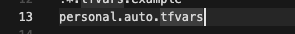
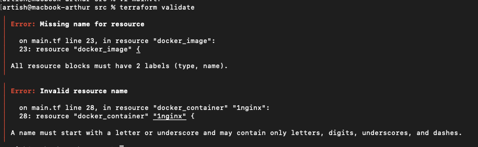
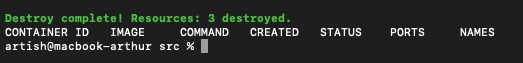
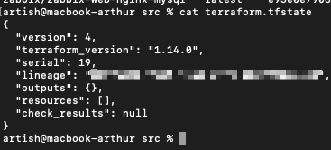
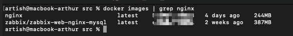
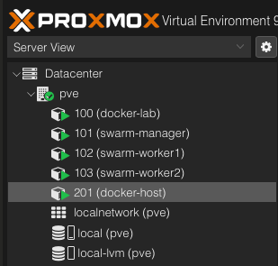
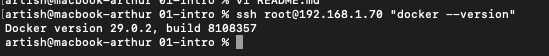
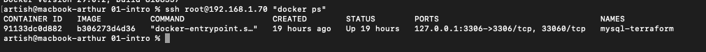
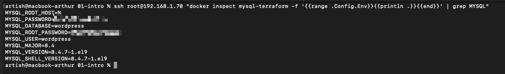

# Домашнее задание к занятию «Введение в Terraform»

---

## Подготовка к выполнению задания

### Установленное ПО

- **Terraform**: v1.14.0
- **Docker**: v28.5.2
- **ОС**: macOS (Apple Silicon)

Скриншот версии Terraform:


---

## Задание 1

### 1.1. Инициализация проекта

Перешел в каталог с заданием и скачал все необходимые зависимости:

```bash
cd ter-homeworks/01/src
terraform init
```

**Результат:**
- Провайдер `kreuzwerker/docker v3.0.2` установлен
- Провайдер `hashicorp/random v3.7.2` установлен
- Создан lock-файл `.terraform.lock.hcl`

---

### 1.2. Изучение .gitignore

**Вопрос:** В каком terraform-файле допустимо сохранить личную, секретную информацию (логины, пароли, ключи, токены)?

**Ответ:** `personal.auto.tfvars`

**Обоснование:**

Согласно файлу `.gitignore`:

```gitignore
# own secret vars store.
personal.auto.tfvars
```

Этот файл:
- Находится в `.gitignore` → не попадет в систему контроля версий
- Имеет суффикс `.auto.tfvars` → Terraform автоматически загружает его при выполнении команд
- Предназначен специально для хранения личных секретных данных локально

Скриншот .gitignore:



---

### 1.3. Выполнение кода и поиск секрета

**Задача:** Найти в state-файле секретное содержимое созданного ресурса `random_password`.

**Команды:**

```bash
terraform apply
# Ввод: yes

# Поиск секрета в state
grep '"result"' terraform.tfstate
```

**Ответ:**
- **Ключ:** `result`
- **Значение:** `<случайно_сгенерированный_пароль_16_символов>` (скрыт для безопасности)

Сгенерированное значение хранится в атрибуте `result` в state-файле.

Скриншот поиска (значение скрыто):


---

### 1.4. Исправление ошибок в коде

**Задача:** Раскомментировать блок кода с docker ресурсами, выполнить `terraform validate` и исправить намеренно допущенные ошибки.

#### Найденные ошибки:

**Ошибка 1: Missing name for resource**

```hcl
# БЫЛО (неправильно):
resource "docker_image" {
  name         = "nginx:latest"
  keep_locally = true
}

# СТАЛО (правильно):
resource "docker_image" "nginx" {
  name         = "nginx:latest"
  keep_locally = true
}
```

---

**Ошибка 2: Invalid resource name**

```hcl
# БЫЛО (неправильно):
resource "docker_container" "1nginx" {
  ...
}

# СТАЛО (правильно):
resource "docker_container" "nginx" {
  ...
}
```

---

**Ошибка 3: Неправильная ссылка на ресурс**

```hcl
# БЫЛО (неправильно):
name = "example_${random_password.random_string_FAKE.resulT}"

# СТАЛО (правильно):
name = "example_${random_password.random_string.result}"
```

**Объяснение:**  
Допущены две ошибки:
1. Неправильное имя ресурса: `random_string_FAKE` вместо `random_string`
2. Неправильный регистр атрибута: `resulT` вместо `result`

Terraform чувствителен к регистру и требует точного соответствия имен ресурсов и их атрибутов.

---

Скриншот ошибок валидации:



После исправления всех ошибок:

```bash
terraform validate
# Success! The configuration is valid.
```

---

### 1.5. Применение исправленного кода

**Исправленный фрагмент кода:**

```hcl
resource "docker_image" "nginx" {
  name         = "nginx:latest"
  keep_locally = true
}

resource "docker_container" "nginx" {
  image = docker_image.nginx.image_id
  name  = "example_${random_password.random_string.result}"

  ports {
    internal = 80
    external = 9090
  }
}
```

**Выполнение:**

```bash
terraform apply
# Ввод: yes
```

**Результат:**

```
Apply complete! Resources: 2 added, 0 changed, 0 destroyed.
```

Созданы:
- Docker образ `nginx:latest`
- Docker контейнер с динамическим именем `example_<случайный_пароль>`
- Проброс портов: 9090 (хост) → 80 (контейнер)

**Проверка:**

```bash
docker ps
curl http://localhost:9090
```

Nginx успешно запущен и отвечает на порту 9090.

Скриншот запущенного контейнера:


---

### 1.6. Изменение имени контейнера и использование -auto-approve

**Задача:** Изменить имя контейнера на `hello_world` и применить с флагом `-auto-approve`.

**Изменение в коде:**

```hcl
resource "docker_container" "nginx" {
  image = docker_image.nginx.image_id
  name  = "hello_world"  # Изменено с dynamic имени
  
  ports {
    internal = 80
    external = 9090
  }
}
```

**Применение:**

```bash
terraform apply -auto-approve
```

**Результат:**

Terraform пересоздал контейнер:
- Удалил старый контейнер `example_<пароль>`
- Создал новый контейнер `hello_world`

```bash
docker ps
```

Скриншот с новым именем:



---

#### Вопросы по флагу -auto-approve

**1. В чём опасность применения ключа `-auto-approve`?**

Флаг `-auto-approve` опасен тем, что Terraform сразу применяет изменения без подтверждения пользователя. 

В обычном режиме Terraform показывает план изменений (что будет создано, изменено, удалено) и запрашивает подтверждение командой `yes`. Это дает возможность:
- Проверить корректность изменений
- Обнаружить потенциально опасные операции (например, удаление production ресурсов)
- Отменить выполнение при обнаружении ошибок

С флагом `-auto-approve` этот защитный механизм отключается. Если в коде допущена ошибка (например, случайно указано удаление важной базы данных), Terraform выполнит деструктивную операцию без возможности остановки.

**Особенно опасно на production окружениях**, где одна опечатка может привести к простою сервисов или потере данных.

**2. Зачем может пригодиться данный ключ?**

Флаг `-auto-approve` полезен для автоматизации в следующих сценариях:

- **CI/CD пайплайны** — автоматическое развертывание инфраструктуры после коммита в git. В пайплайне нет интерактивного режима, поэтому невозможно вручную вводить подтверждение.

- **Автоматизированные скрипты** — например, ежедневное пересоздание тестовых окружений по расписанию без участия человека.

- **Повторяющиеся безопасные операции** — когда код многократно проверен и риск ошибки минимален, можно сэкономить время на ручном подтверждении.

- **Non-interactive режим** — выполнение Terraform в headless окружениях (контейнеры, серверы без UI).

---

### 1.7. Уничтожение созданных ресурсов

**Команда:**

```bash
terraform destroy
# Ввод: yes
```

**Результат:**

```
Destroy complete! Resources: 3 destroyed.
```

Удалены:
- Docker контейнер `hello_world`
- Ресурс `random_password`
- (Docker образ `nginx:latest` НЕ удален — см. задание 1.8)

**Проверка:**

```bash
docker ps
# CONTAINER ID   IMAGE     COMMAND   CREATED   STATUS    PORTS     NAMES
# (пусто)
```

Скриншот после destroy:


**Содержимое terraform.tfstate после destroy:**

```json
{
  "version": 4,
  "terraform_version": "1.14.0",
  "serial": 19,
  "lineage": "xxxxxxxx-xxxx-xxxx-xxxx-xxxxxxxxxxxx",
  "outputs": {},
  "resources": [],
  "check_results": null
}
```

State файл содержит только базовую структуру, массив `resources` пуст — Terraform "забыл" о всех управляемых ресурсах.

Скриншот пустого state:



---

### 1.8. Объяснение сохранения docker-образа

**Вопрос:** Почему при выполнении `terraform destroy` не был удалён docker-образ `nginx:latest`?

**Проверка:**

```bash
docker images | grep nginx
# nginx   latest   ...   4 days ago   244MB
```

Образ остался на диске:



---

**Ответ:**

Docker-образ `nginx:latest` не был удален из-за параметра `keep_locally = true` в конфигурации ресурса `docker_image`.

**Код из main.tf:**

```hcl
resource "docker_image" "nginx" {
  name         = "nginx:latest"
  keep_locally = true  # ← Этот параметр
}
```

**Объяснение:**

Параметр `keep_locally` управляет поведением Terraform при удалении ресурса:

- **`keep_locally = true`** — при выполнении `terraform destroy` образ остается в локальном хранилище Docker. Terraform удаляет только свою запись о ресурсе из state, но сам образ на диске сохраняется.

- **`keep_locally = false`** — при выполнении `terraform destroy` Terraform удаляет образ из локального Docker полностью (выполняет `docker rmi`).

# Задание 2: Remote Docker на Proxmox LXC

## Выполнение

### 1. Создание LXC контейнера

Вместо Yandex Cloud VM используется LXC контейнер на локальном Proxmox сервере.

**Конфигурация:**
- ID: 201
- Hostname: docker-host
- ОС: Ubuntu 22.04
- CPU: 2 cores
- RAM: 2GB
- Disk: 16GB
- IP: 192.168.1.70/24

Скриншот созданного контейнера в Proxmox:



### 2. Установка Docker

Docker установлен автоматически через Terraform provisioner:
- Использован `pct exec` для выполнения команд без SSH
- Сначала установлен OpenSSH Server
- Затем установлен Docker CE 29.0.2

```bash
ssh root@192.168.1.70 "docker --version"
# Docker version 29.0.2
```

Скриншот версии Docker:



### 3. Remote Docker подключение

Terraform настроен для подключения к Docker через SSH:

```hcl
provider "docker" {
  host = "ssh://root@192.168.1.70:22"
  
  ssh_opts = [
    "-o", "StrictHostKeyChecking=no",
    "-o", "UserKnownHostsFile=/dev/null"
  ]
}
```

### 4. MySQL контейнер с генерируемыми паролями

Созданы два random_password ресурса:
- `mysql_root_password` - пароль root
- `mysql_user_password` - пароль для пользователя wordpress

**Конфигурация MySQL:**

```hcl
resource "docker_container" "mysql" {
  name  = "mysql-terraform"
  image = docker_image.mysql.image_id
  
  security_opts = ["apparmor=unconfined"]
  
  env = [
    "MYSQL_ROOT_PASSWORD=${random_password.mysql_root_password.result}",
    "MYSQL_DATABASE=wordpress",
    "MYSQL_USER=wordpress",
    "MYSQL_PASSWORD=${random_password.mysql_user_password.result}",
    "MYSQL_ROOT_HOST=%"
  ]
  
  ports {
    internal = 3306
    external = 3306
    ip       = "127.0.0.1"
  }
}
```

### 5. Проверка ENV переменных

```bash
ssh root@192.168.1.70 "docker ps"
```

Скриншот docker ps:



**Результат:**
```
CONTAINER ID   IMAGE          COMMAND                  CREATED   STATUS   PORTS                                 NAMES
91133dc0d882   b306273d4d36   "docker-entrypoint.s…"   ...       Up       127.0.0.1:3306->3306/tcp, 33060/tcp   mysql-terraform
```

**ENV переменные:**
```bash
ssh root@192.168.1.70 "docker inspect mysql-terraform -f '{{range .Config.Env}}{{println .}}{{end}}' | grep MYSQL"
```

Скриншот ENV переменных:



```
MYSQL_ROOT_HOST=%
MYSQL_PASSWORD=<сгенерированный_пароль>
MYSQL_DATABASE=wordpress
MYSQL_ROOT_PASSWORD=<сгенерированный_пароль>
MYSQL_USER=wordpress
```

---

## Outputs

```bash
terraform output
```

```
lxc_container_id = 201
lxc_container_ip = "192.168.1.70/24"
lxc_hostname = "docker-host"
mysql_root_password = <sensitive>
mysql_user_password = <sensitive>
ssh_command = "ssh root@192.168.1.70/24"
```

Просмотр паролей:
```bash
terraform output mysql_root_password
terraform output mysql_user_password
```

---
