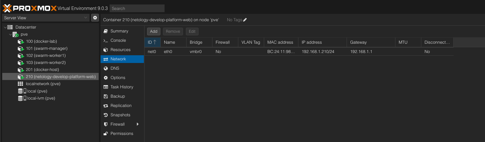
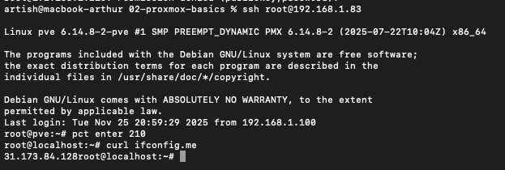
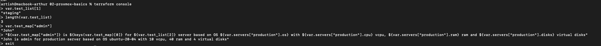

# Задание 2: Основы Terraform (Proxmox адаптация)

## Задание 1

### Что сделано:
- Изучен проект с переменными
- Настроен API токен Proxmox (root@pam)
- Использован SSH ключ `~/.ssh/id_ed25519.pub`
- Выполнен `terraform init`
- Найдены и исправлены 3 ошибки в коде
- Создан LXC контейнер через `terraform apply`
- Выполнена проверка через SSH

### Найденные ошибки:

1. **Неправильное имя ноды**: было `"standart-v4"`, исправлено на `"pve"`
2. **Недостаточно памяти**: было `1` МБ, исправлено на `1024` МБ (1 ГБ)
3. **IP без CIDR маски**: было `"192.168.1.210"`, исправлено на `"192.168.1.210/24"`

### Скриншоты:

**Proxmox UI с созданным контейнером:**


**Результат curl ifconfig.me:**


### Вопрос: Как пригодятся параметры `preemptible` и `core_fraction`?

**Ответ:** Эти параметры помогают экономить деньги в облаке при обучении:
- `preemptible = true` - прерываемые ВМ дешевле на 70%, могут быть остановлены через 24 часа
- `core_fraction = 5` - минимальная гарантированная доля CPU (5%), дешевле чем 100%

### Внешний IP контейнера:
`31.173.84.61` (совпадает с IP Proxmox сервера, т.к. контейнер за NAT)

---

## Задание 2

### Что сделано:
- Вынесены все hardcode-значения из `main.tf` в переменные
- Добавлены переменные с префиксом `vm_web_` в `variables.tf`
- Проверено через `terraform plan` - изменений нет

### Созданные переменные:

| Переменная | Тип | Значение по умолчанию | Описание |
|------------|-----|----------------------|----------|
| `vm_web_name` | string | "netology-develop-platform-web" | Имя контейнера |
| `vm_web_vmid` | number | 210 | ID контейнера |
| `vm_web_cores` | number | 1 | Количество ядер CPU |
| `vm_web_memory` | number | 1024 | Память в МБ |
| `vm_web_disk_size` | number | 8 | Размер диска в ГБ |
| `vm_web_ip` | string | "192.168.1.210/24" | IP адрес с CIDR маской |

### Результат terraform plan:
```
No changes. Your infrastructure matches the configuration.
```

Инфраструктура осталась неизменной - переменные правильно заменили hardcode значения.

### Зачем выносить в переменные:

- **Гибкость**: Легко создать несколько контейнеров с разными параметрами
- **Читаемость**: Код в `main.tf` стал понятнее
- **Переиспользование**: Можно использовать переменные в разных местах
- **Безопасность**: Чувствительные данные можно хранить отдельно в `terraform.tfvars`


---

## Задание 3

### Что сделано:
- Создан файл `vms_platform.tf` с переменными для VM/контейнеров
- Перенесены переменные `vm_web_*` из `variables.tf` в `vms_platform.tf`
- Добавлены переменные `vm_db_*` для второго контейнера
- Создан второй контейнер для базы данных в `main.tf`
- Добавлены outputs для отображения IP обоих контейнеров

### Параметры созданных контейнеров:

| Параметр | Web (210) | DB (211) |
|----------|-----------|----------|
| **Имя** | netology-develop-platform-web | netology-develop-platform-db |
| **Cores** | 1 | 2 |
| **Memory** | 1024 МБ (1 ГБ) | 2048 МБ (2 ГБ) |
| **Disk** | 8 ГБ | 8 ГБ |
| **IP** | 192.168.1.210/24 | 192.168.1.211/24 |

### Результат terraform output:
```
container_ip = "192.168.1.210/24"
container_name = "netology-develop-platform-web"

container_db_ip = "192.168.1.211/24"
container_db_name = "netology-develop-platform-db"
```

### Скриншот:

**Оба контейнера в Proxmox UI:**


---

## Задание 4

### Что сделано:
- Создан единый output `containers_info` с информацией о всех контейнерах
- Output содержит: instance_name, internal_ip, hostname
- Без хардкода - данные берутся из ресурсов Terraform

### Результат terraform output containers_info:
```
containers_info = {
  "web" = {
    "hostname"      = "netology-develop-platform-web"
    "instance_name" = "netology-develop-platform-web"
    "internal_ip"   = "192.168.1.210/24"
  }
  "db" = {
    "hostname"      = "netology-develop-platform-db"
    "instance_name" = "netology-develop-platform-db"
    "internal_ip"   = "192.168.1.211/24"
  }
}
```

**Примечание:** В Proxmox LXC окружении нет "external_ip". Контейнеры находятся в локальной сети за NAT Proxmox сервера.


### Вывод команды terraform output:
```
container_db_ip = "192.168.1.211/24"
container_db_name = "netology-develop-platform-db"

container_ip = "192.168.1.210/24"
container_name = "netology-develop-platform-web"

containers_info = {
  "db" = {
    "hostname"      = "netology-develop-platform-db"
    "instance_name" = "netology-develop-platform-db"
    "internal_ip"   = "192.168.1.211/24"
  }
  "web" = {
    "hostname"      = "netology-develop-platform-web"
    "instance_name" = "netology-develop-platform-web"
    "internal_ip"   = "192.168.1.210/24"
  }
}
```

**Примечание:** В Proxmox LXC окружении контейнеры находятся в локальной сети за NAT.

---

## Задание 5

### Что сделано:
- Создан файл `locals.tf` с local-переменными
- Использована интерполяция для формирования имён контейнеров
- Заменены переменные `var.vm_web_name` и `var.vm_db_name` на local-переменные в `main.tf`
- Проверено через `terraform plan` - изменений в инфраструктуре нет

### Содержимое locals.tf:
```hcl
locals {
  # Общие параметры для именования
  project_name = "netology"
  env_name     = "develop"
  
  # Формируем имена контейнеров через интерполяцию
  vm_web_name = "${local.project_name}-${local.env_name}-platform-web"
  vm_db_name  = "${local.project_name}-${local.env_name}-platform-db"
}
```

### Преимущества использования locals:

- **Централизация**: Имена генерируются из общих параметров (`project_name`, `env_name`)
- **Гибкость**: Легко изменить префикс или окружение в одном месте
- **Стандартизация**: Все имена следуют единому паттерну
- **DRY принцип**: Не повторяем одни и те же значения

### Результат:

Имена контейнеров остались прежними, но теперь генерируются динамически:
- `netology-develop-platform-web`
- `netology-develop-platform-db`


---

## Задание 6

### Что сделано:
- Объединены переменные ресурсов (cores, memory, disk_size) в map-переменную `vms_resources`
- Создана map-переменная `vm_metadata` для общих метаданных
- Закомментированы неиспользуемые переменные в `vms_platform.tf`
- Проверено через `terraform plan` - изменений нет

### Структура vms_resources:
```hcl
vms_resources = {
  web = {
    cores     = 1
    memory    = 1024
    disk_size = 8
  }
  db = {
    cores     = 2
    memory    = 2048
    disk_size = 8
  }
}
```

### Структура vm_metadata:
```hcl
vm_metadata = {
  nesting      = "true"
  unprivileged = "true"
}
```

### Использование в main.tf:
```hcl
cpu {
  cores = var.vms_resources["web"].cores
}

memory {
  dedicated = var.vms_resources["web"].memory
}

disk {
  size = var.vms_resources["web"].disk_size
}
```

### Преимущества:

- **Группировка**: Все параметры контейнера в одном объекте
- **Масштабируемость**: Легко добавить новый контейнер в map
- **DRY**: Не дублируем структуру переменных для каждого контейнера
- **Читаемость**: `vms_resources["web"].cores` понятнее чем отдельные переменные


---

## Задание 7* (дополнительное)

### Работа в Terraform Console

Создан файл `console.tf` с тестовыми данными (списки, map, объекты).

### Выполненные команды и результаты:

**1. Отображение второго элемента списка test_list:**
```
> var.test_list[1]
"staging"
```

**2. Длина списка test_list:**
```
> length(var.test_list)
3
```

**3. Значение ключа admin из map test_map:**
```
> var.test_map["admin"]
"John"
```

**4. Interpolation-выражение:**
```terraform
> "${var.test_map["admin"]} is ${keys(var.test_map)[0]} for ${var.test_list[2]} server based on OS ${var.servers["production"].os} with ${var.servers["production"].cpu} vcpu, ${var.servers["production"].ram} ram and ${var.servers["production"].disks} virtual disks"

"John is admin for production server based on OS ubuntu-20-04 with 10 vcpu, 40 ram and 4 virtual disks"
```

### Использованные функции и конструкции:

- **Индексация списка**: `var.test_list[1]` - доступ ко второму элементу (индекс с 0)
- **Функция length()**: `length(var.test_list)` - получение длины списка
- **Доступ к map**: `var.test_map["admin"]` - получение значения по ключу
- **Функция keys()**: `keys(var.test_map)[0]` - получение первого ключа из map
- **Interpolation**: `"${...}"` - встраивание значений в строку
- **Доступ к вложенным объектам**: `var.servers["production"].cpu` - доступ к полю объекта

### Скриншот выполнения:



