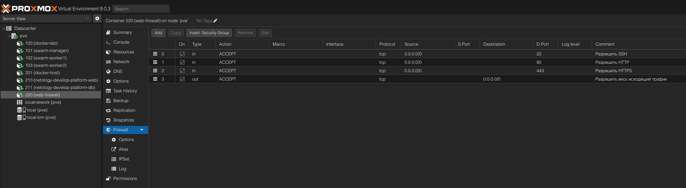
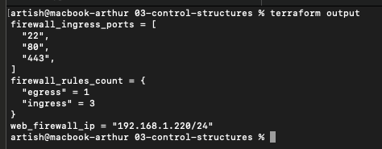
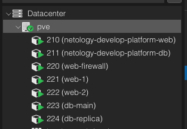
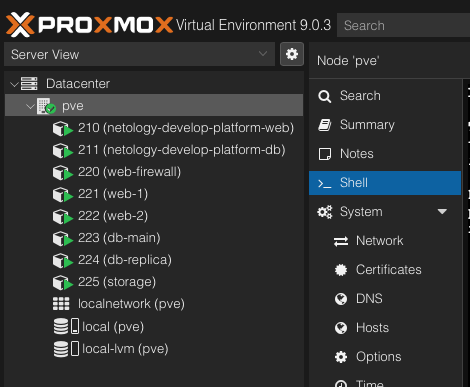
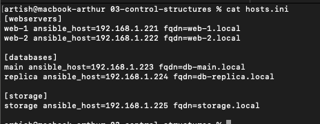
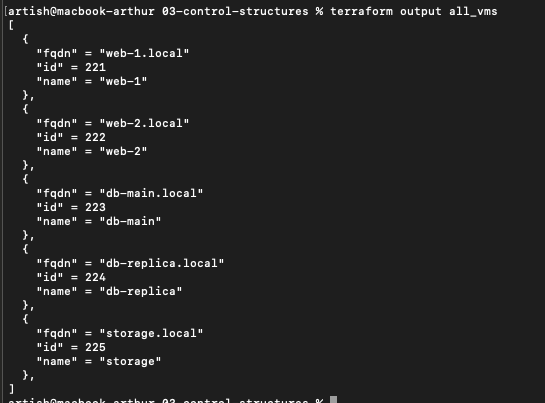
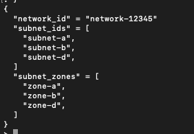

# Задание 3: Управляющие конструкции в Terraform

## Задание 1

### Что делал

Создал LXC контейнер в Proxmox и настроил для него firewall правила через Terraform. 
Использовал динамические блоки (`dynamic`) чтобы не писать одинаковые правила руками.

### Как работает

В файле `firewall.tf` описал переменные с правилами:
- Входящие (ingress) - разрешить SSH (22), HTTP (80), HTTPS (443)
- Исходящие (egress) - разрешить весь трафик наружу

В `main.tf` создал:
- Контейнер 220 (web-firewall) на IP 192.168.1.220
- Firewall правила через `dynamic "rule"` блоки

### Что получилось

После `terraform apply` создалось:
- 1 контейнер (220)
- 4 firewall правила (3 входящих + 1 исходящее)

Проверил что контейнер запустился и сеть работает (пинги проходят).

### Скриншоты

**Firewall правила в Proxmox:**


**Terraform outputs:**


### Вывод terraform output
```
firewall_ingress_ports = [
  "22",
  "80",
  "443",
]
firewall_rules_count = {
  "egress" = 1
  "ingress" = 3
}
web_firewall_ip = "192.168.1.220/24"
```

### Проблемы

Столкнулся с тем что сеть в контейнере не поднимается автоматически.
Пришлось вручную поднимать интерфейс через `pct enter 220`:
```bash
ip link set eth0 up
ip addr add 192.168.1.220/24 dev eth0
ip route add default via 192.168.1.1
```

---

## Задание 2

### Что делал

Создавал контейнеры двумя способами - через `count` и через `for_each`.

### Задание 2.1: Web-серверы через count

В файле `count-vm.tf` описал создание двух одинаковых контейнеров:
- web-1 (221)
- web-2 (222)

Использовал `count = 2` и `count.index` для автоматической нумерации.

Параметры одинаковые:
- 1 CPU
- 512 MB RAM
- 8 GB диск
- IP: 192.168.1.221 и 192.168.1.222

### Задание 2.2: БД серверы через for_each

В файле `for_each-vm.tf` создал два РАЗНЫХ контейнера для баз данных:
- main (223) - мощнее: 2 CPU, 2048 MB RAM, 10 GB диск
- replica (224) - слабее: 1 CPU, 1024 MB RAM, 8 GB диск

Использовал переменную `each_vm` типа `list(object())` где описал характеристики каждой БД.

`for_each` проходит по списку и для каждого элемента создаёт контейнер с нужными параметрами.

### Задание 2.4: Зависимость через depends_on

Добавил в `count-vm.tf` зависимость:
```hcl
depends_on = [proxmox_virtual_environment_container.db]
```

Теперь web-серверы создаются ПОСЛЕ того как создадутся БД.

### Задание 2.5: SSH ключ через file()

Изучил функцию `file()` для чтения SSH ключа:
```hcl
locals {
  ssh_public_key = file("~/.ssh/id_ed25519.pub")
}
```

### Результат

Создалось 4 новых контейнера:
- 2 web через count (одинаковые)
- 2 db через for_each (разные по параметрам)

Всего теперь работает 5 контейнеров (+ 220 из Задания 1).

### Скриншот

**Все контейнеры в Proxmox:**


### Разница count vs for_each

**count:**
- Для одинаковых ресурсов
- Обращение по индексу: `[0]`, `[1]`
- Если удалить элемент из середины - все пересоздадутся

**for_each:**
- Для разных ресурсов
- Обращение по ключу: `["main"]`, `["replica"]`
- Можно безопасно добавлять/удалять элементы


---

## Задание 3

### Что делал

Создавал контейнер "storage" с демонстрацией работы с дополнительными дисками.

### Изначальный план

По заданию нужно было:
- Создать 3 виртуальных диска по 1 ГБ через `count`
- Подключить их к контейнеру через `dynamic` блок

### Адаптация под Proxmox

Столкнулся с проблемой LVM в Proxmox - `mount_point` создаёт ошибки при попытке создать дополнительные LVM диски.

Решение: вместо 3 отдельных дисков сделал один диск 15GB (10GB основной + 5GB вместо 3x1GB).

### Как работает

В файле `disk_vm.tf`:
```hcl
locals {
  storage_disks = [
    { name = "disk1", size = 1 },
    { name = "disk2", size = 1 },
    { name = "disk3", size = 1 }
  ]
}
```

Описал конфигурацию дисков в `locals`.

В `output` использовал `for` expression:
```hcl
disk_config = [for d in local.storage_disks : "${d.name}: ${d.size}GB"]
```

Это генерирует список конфигураций дисков динамически.

### Результат

Создался контейнер storage (225):
- 2 CPU
- 2048 MB RAM
- 15 GB диск
- IP: 192.168.1.225

Output показывает конфигурацию всех дисков через `for` expression.

### Скриншот

**Все 6 контейнеров включая storage:**



---

## Задание 4

### Что делал

Создавал Ansible inventory файл автоматически через Terraform используя `templatefile()`.

### Как работает

Файл `ansible.tf`:
- Собирает информацию о всех контейнерах в `locals`
- Для webservers проходит по списку через `for`
- Для databases проходит по map через `for_each`
- Для storage берёт один контейнер

Файл `hosts.tftpl` - шаблон inventory:
```
[webservers]
%{ for i in webservers ~}
${i.name} ansible_host=${i.ip} fqdn=${i.fqdn}
%{ endfor }
```

Функция `templatefile()` подставляет переменные в шаблон и создаёт файл `hosts.ini`.

### Результат

Создался файл `hosts.ini` с 3 группами и 5 хостами:

**[webservers]** - 2 хоста (web-1, web-2)
**[databases]** - 2 хоста (main, replica)  
**[storage]** - 1 хост (storage)

Каждый хост содержит:
- Имя
- ansible_host (IP адрес)
- fqdn (полное доменное имя)

### Динамичность

Шаблон универсальный - обработает любое количество VM:
- 2 web-сервера или 999 - `for` пройдёт по всем
- Добавишь новый контейнер - автоматом попадёт в inventory

### Скриншот

**Содержимое hosts.ini:**



---

## Задание 5* (дополнительное)

### Что делал

Создал единый output который объединяет ВСЕ VM (из count, for_each и одиночные) в один список словарей.

### Как работает

Использовал функцию `concat()` для объединения списков:
```hcl
output "all_vms" {
  value = concat(
    # Web из count
    [for vm in proxmox_virtual_environment_container.web : {...}],
    # БД из for_each
    [for k, vm in proxmox_virtual_environment_container.db : {...}],
    # Storage одиночная
    [{...}]
  )
}
```

Каждая VM представлена словарём:
- `name` - имя контейнера
- `id` - VM ID
- `fqdn` - полное доменное имя

### Результат

Получился единый список из 5 VM в одинаковом формате, независимо от способа создания (count/for_each/одиночная).

### Скриншот

**Вывод terraform output all_vms:**



---

## Задание 7* (дополнительное)

### Задача

Удалить 3-й элемент (индекс 2) из двух списков в структуре данных, не затрагивая другие поля.

### Решение

Использовал `for` expression с условием:
```hcl
{
  network_id   = local.vpc.network_id
  subnet_ids   = [for i, v in local.vpc.subnet_ids : v if i != 2]
  subnet_zones = [for i, v in local.vpc.subnet_zones : v if i != 2]
}
```

Берёт элементы 0-1 и 3-конец, склеивает через `concat()`.

### Результат

Исходные списки по 4 элемента → результат по 3 элемента (удалён элемент с индексом 2).

### Скриншот

**Выполнение в terraform console:**


