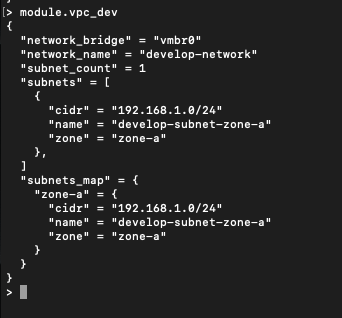

# Задание 4: Продвинутые методы работы с Terraform

## Задание 1

### Что делал

Создавал контейнеры через локальный модуль. Вместо remote-модуля из GitHub сделал свой модуль для Proxmox LXC.

### Как работает модуль

Модуль `proxmox-lxc` принимает параметры:
- Количество контейнеров
- Название проекта (для tags)
- CPU, RAM, диск
- IP адреса
- SSH ключ

Один модуль - используется дважды с разными параметрами.

### Два вызова модуля

**Marketing (2 контейнера):**
```hcl
module "marketing_vm" {
  source = "./modules/proxmox-lxc"
  
  instance_count = 2
  instance_name  = "web"
  project        = "marketing"
  
  vm_id_start = 230
  cpu_cores   = 1
  memory      = 1024
}
```

**Analytics (1 контейнер):**
```hcl
module "analytics_vm" {
  source = "./modules/proxmox-lxc"
  
  instance_count = 1
  instance_name  = "analytics"
  project        = "analytics"
  
  vm_id_start = 232
  cpu_cores   = 2
  memory      = 2048
}
```

### SSH ключ через переменную

Вместо hardcode использовал переменную `var.ssh_public_key`:
```hcl
user_account {
  keys = [var.ssh_public_key]
}
```

Значение передаётся из `terraform.tfvars` который не попадает в git.

### Установка nginx

Nginx установлен вручную в каждом контейнере:
```bash
apt update && apt install -y nginx
systemctl enable nginx
systemctl start nginx
```

Проверка:
```bash
nginx -t
```

### Результат

Создано 3 контейнера:
- marketing-web-1 (230) - IP 192.168.1.230
- marketing-web-2 (231) - IP 192.168.1.231  
- analytics-analytics-1 (232) - IP 192.168.1.232

Каждый с установленным nginx и соответствующими tags (метками).

### Скриншоты

**Nginx test successful:**


**Tags в Proxmox UI:**


**Содержимое модуля в terraform console:**


### Адаптация под Proxmox

Вместо Yandex Cloud remote-модуля создал локальный модуль для Proxmox LXC.
Cloud-init для LXC не поддерживается провайдером, поэтому nginx установлен через SSH.


---

## Задание 2

### Что делал

Создал модуль `vpc` для управления сетевой конфигурацией.

### Параметры модуля

Модуль принимает:
- `env_name` - окружение (develop, stage, prod)
- `zone` - зона сети
- `cidr` - CIDR блок подсети
- `bridge` - Proxmox bridge (по умолчанию vmbr0)

### Вызов модуля
```hcl
module "vpc_dev" {
  source   = "./modules/vpc"
  env_name = "develop"
  zone     = "zone-a"
  cidr     = "192.168.1.0/24"
}
```

### Использование в других модулях

Передача параметров из vpc модуля в модуль контейнеров:
```hcl
module "marketing_vm" {
  source = "./modules/proxmox-lxc"
  
  network_bridge = module.vpc_dev.network_bridge
  # ... остальные параметры
}
```

### Outputs модуля

Модуль возвращает:
- `network_name` - имя сети
- `network_bridge` - bridge для подключения
- `subnet_cidr` - CIDR подсети
- `subnet_info` - полная информация о подсети

### Terraform-docs

Сгенерирована документация для модуля vpc с помощью terraform-docs.
Документация находится в `modules/vpc/README.md` и содержит:
- Список входных переменных с описанием и типами
- Список выходных значений
- Требования к провайдерам

### Скриншоты

**Содержимое модуля vpc в terraform console:**


### Адаптация под Proxmox

В Proxmox сети (bridges) создаются на уровне ОС хоста, поэтому модуль vpc создаёт логическую абстракцию для совместимости с концепцией VPC из облачных провайдеров.


---

## Задание 3

### Работа со state

#### 1. Список ресурсов в state
```bash
terraform state list
```

Результат:
```
module.analytics_vm.proxmox_virtual_environment_container.this[0]
module.marketing_vm.proxmox_virtual_environment_container.this[0]
module.marketing_vm.proxmox_virtual_environment_container.this[1]
```

#### 2. Удаление модулей из state
```bash
# Удаление marketing_vm
terraform state rm 'module.marketing_vm.proxmox_virtual_environment_container.this[0]'
terraform state rm 'module.marketing_vm.proxmox_virtual_environment_container.this[1]'

# Удаление analytics_vm
terraform state rm 'module.analytics_vm.proxmox_virtual_environment_container.this[0]'

# Проверка
terraform state list
# (пусто)
```

#### 3. Импорт обратно
```bash
# Формат для bpg/proxmox: node_name/vm_id
terraform import 'module.marketing_vm.proxmox_virtual_environment_container.this[0]' pve/230
terraform import 'module.marketing_vm.proxmox_virtual_environment_container.this[1]' pve/231
terraform import 'module.analytics_vm.proxmox_virtual_environment_container.this[0]' pve/232
```

Все 3 импорта успешны: "Import successful!"

#### 4. Проверка
```bash
terraform state list
# Все 3 ресурса вернулись

terraform plan
# Plan: 3 to add, 0 to change, 3 to destroy
```

### Особенности импорта LXC контейнеров

При импорте Proxmox LXC контейнеров возникают отличия в state из-за:
- `unprivileged` параметр не импортируется корректно
- `operating_system` блок не восстанавливается
- `user_account` в initialization не сохраняется в state

Это **ограничение провайдера bpg/proxmox v0.71.0** при работе с LXC.

### Скриншоты

**Список ресурсов в state:**


**Пустой state после удаления:**


**Plan после импорта:**


---

## Задание 4* (дополнительное)

### Что делал

Улучшил модуль vpc для создания множественных подсетей через list(object).

### Изменения в модуле

**variables.tf:**
```hcl
variable "subnets" {
  description = "List of subnets to create"
  type = list(object({
    zone = string
    cidr = string
  }))
}
```

**main.tf:**
```hcl
locals {
  subnets_list = [
    for idx, subnet in var.subnets : {
      name = "${var.env_name}-subnet-${subnet.zone}"
      zone = subnet.zone
      cidr = subnet.cidr
    }
  ]
  
  subnets_map = {
    for subnet in local.subnets_list :
    subnet.zone => subnet
  }
}
```

### Примеры вызовов

**Production с 3 подсетями:**
```hcl
module "vpc_prod" {
  source   = "./modules/vpc"
  env_name = "production"
  subnets = [
    { zone = "zone-a", cidr = "10.0.1.0/24" },
    { zone = "zone-b", cidr = "10.0.2.0/24" },
    { zone = "zone-c", cidr = "10.0.3.0/24" },
  ]
}
```

**Development с 1 подсетью:**
```hcl
module "vpc_dev" {
  source   = "./modules/vpc"
  env_name = "develop"
  subnets = [
    { zone = "zone-a", cidr = "192.168.1.0/24" },
  ]
}
```

### Результат

Модуль динамически создаёт нужное количество подсетей:
- `subnets` - список всех подсетей
- `subnets_map` - map для доступа по zone
- `subnet_count` - количество подсетей

### Скриншоты

**VPC Development (1 подсеть):**


**VPC Production (3 подсети):**


